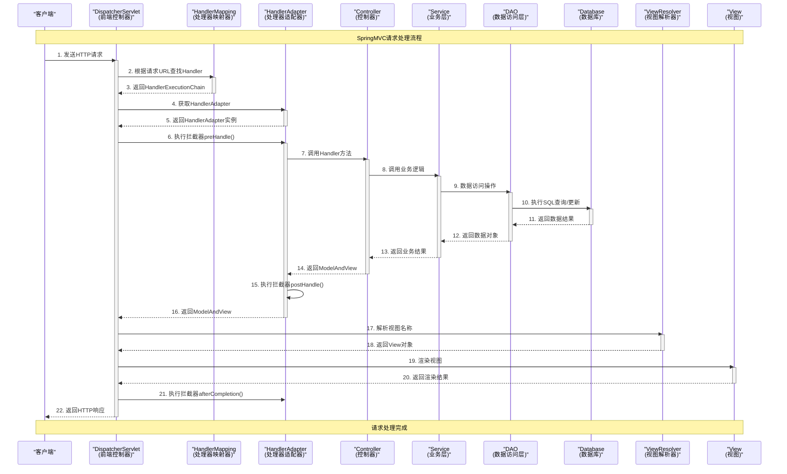

# SpringMVC 请求处理流程时序图

## 流程说明

### 主要组件
- **DispatcherServlet**: SpringMVC的前端控制器，负责统一调度
- **HandlerMapping**: 处理器映射器，根据URL找到对应的Handler
- **HandlerAdapter**: 处理器适配器，执行具体的Handler方法
- **Controller**: 控制器，处理具体的业务请求
- **Service**: 业务逻辑层，处理业务逻辑
- **DAO**: 数据访问层，负责数据库操作
- **ViewResolver**: 视图解析器，解析逻辑视图名
- **View**: 视图，负责渲染页面

### 关键步骤
1. **请求接收**: DispatcherServlet接收客户端HTTP请求
2. **Handler查找**: 通过HandlerMapping找到对应的处理器
3. **Handler执行**: 通过HandlerAdapter执行具体的Controller方法
4. **业务处理**: Controller调用Service层处理业务逻辑
5. **数据访问**: Service层通过DAO访问数据库
6. **视图处理**: DispatcherServlet通过ViewResolver解析并渲染视图
7. **响应返回**: 将处理结果返回给客户端

### 拦截器机制
- **preHandle()**: 在Handler执行前调用
- **postHandle()**: 在Handler执行后、视图渲染前调用  
- **afterCompletion()**: 在整个请求完成后调用