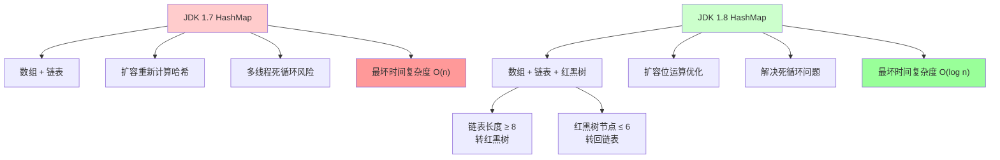
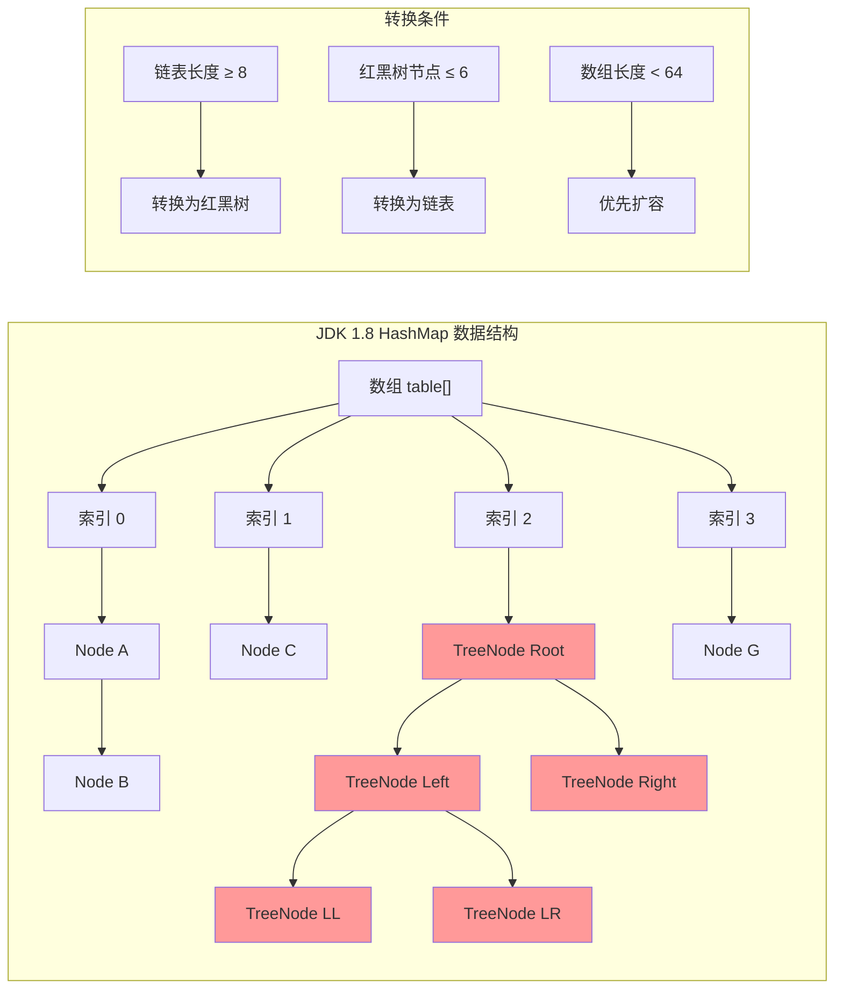
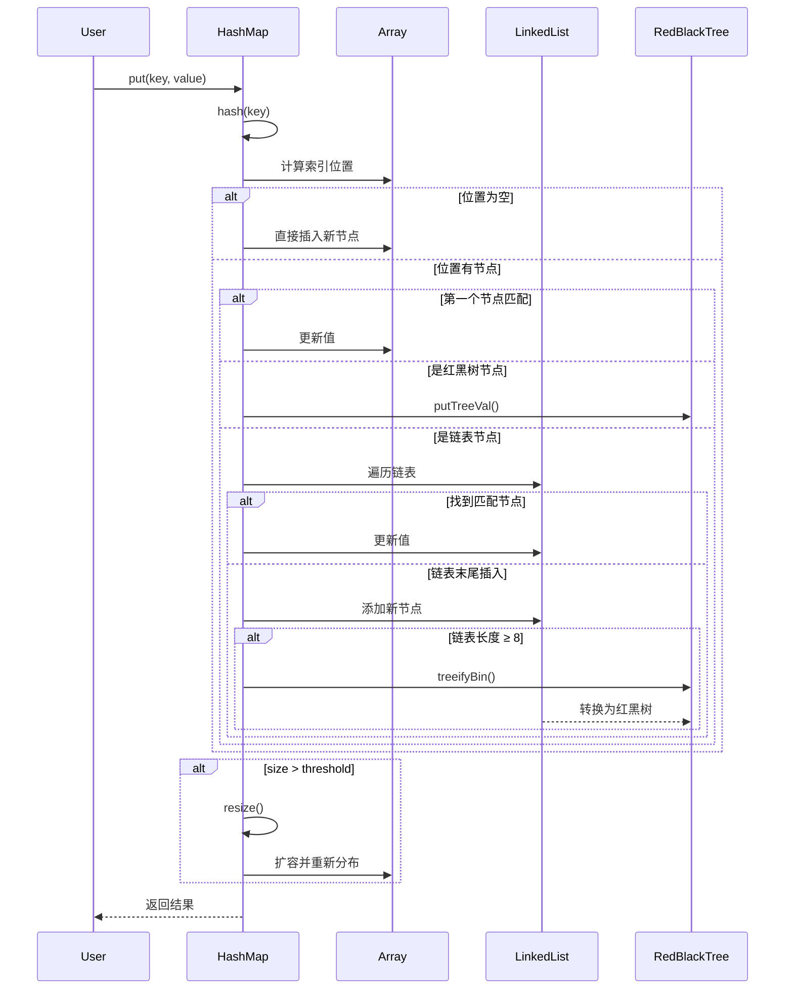

# JDK 1.8 HashMap 源码深度解析

## 🎯 概述

JDK 1.8 对 HashMap 进行了重大优化，主要解决了 JDK 1.7 中的性能瓶颈和并发安全问题。核心改进包括：

- ✅ **数据结构优化**：数组 + 链表 + 红黑树
- ✅ **扩容算法优化**：避免重新计算哈希值
- ✅ **哈希算法改进**：减少哈希冲突
- ✅ **并发安全性提升**：解决死循环问题

## 📊 JDK 1.7 vs 1.8 数据结构对比

### JDK 1.7 结构
```
数组 + 链表
┌─────┬─────┬─────┬─────┐
│  0  │  1  │  2  │  3  │
├─────┼─────┼─────┼─────┤
│ A→B │  C  │D→E→F│  G  │
└─────┴─────┴─────┴─────┘
```

### JDK 1.8 结构
```
数组 + 链表 + 红黑树
┌─────┬─────┬─────┬─────┐
│  0  │  1  │  2  │  3  │
├─────┼─────┼─────┼─────┤
│ A→B │  C  │ 红黑树 │  G  │
└─────┴─────┴─────┴─────┘
```

## 🔧 核心数据结构源码分析

### 1. Node 节点结构

```java
static class Node<K,V> implements Map.Entry<K,V> {
    final int hash;    // 哈希值
    final K key;       // 键
    V value;           // 值
    Node<K,V> next;    // 指向下一个节点
    
    Node(int hash, K key, V value, Node<K,V> next) {
        this.hash = hash;
        this.key = key;
        this.value = value;
        this.next = next;
    }
}
```

### 2. TreeNode 红黑树节点

```java
static final class TreeNode<K,V> extends LinkedHashMap.Entry<K,V> {
    TreeNode<K,V> parent;  // 父节点
    TreeNode<K,V> left;    // 左子节点
    TreeNode<K,V> right;   // 右子节点
    TreeNode<K,V> prev;    // 前一个节点
    boolean red;           // 颜色标识
}
```

## 🚀 核心方法源码解析

### 1. hash() 方法优化

**JDK 1.7 哈希算法：**
```java
final int hash(Object k) {
    int h = hashSeed;
    if (0 != h && k instanceof String) {
        return sun.misc.Hashing.stringHash32((String) k);
    }
    h ^= k.hashCode();
    h ^= (h >>> 20) ^ (h >>> 12);
    return h ^ (h >>> 7) ^ (h >>> 4);
}
```

**JDK 1.8 哈希算法：**
```java
static final int hash(Object key) {
    int h;
    return (key == null) ? 0 : (h = key.hashCode()) ^ (h >>> 16);
}
```

**优化点：**
- 🎯 **简化算法**：减少位运算次数，提高性能
- 🎯 **高位参与**：让高 16 位参与运算，减少哈希冲突

### 2. put() 方法核心逻辑

```java
public V put(K key, V value) {
    return putVal(hash(key), key, value, false, true);
}

final V putVal(int hash, K key, V value, boolean onlyIfAbsent, boolean evict) {
    Node<K,V>[] tab; Node<K,V> p; int n, i;
    
    // 1. 初始化或扩容
    if ((tab = table) == null || (n = tab.length) == 0)
        n = (tab = resize()).length;
    
    // 2. 计算索引位置，如果为空直接插入
    if ((p = tab[i = (n - 1) & hash]) == null)
        tab[i] = newNode(hash, key, value, null);
    else {
        Node<K,V> e; K k;
        
        // 3. 检查第一个节点是否匹配
        if (p.hash == hash && ((k = p.key) == key || (key != null && key.equals(k))))
            e = p;
        // 4. 如果是红黑树节点
        else if (p instanceof TreeNode)
            e = ((TreeNode<K,V>)p).putTreeVal(this, tab, hash, key, value);
        // 5. 链表处理
        else {
            for (int binCount = 0; ; ++binCount) {
                if ((e = p.next) == null) {
                    p.next = newNode(hash, key, value, null);
                    // 链表长度达到阈值，转换为红黑树
                    if (binCount >= TREEIFY_THRESHOLD - 1)
                        treeifyBin(tab, hash);
                    break;
                }
                if (e.hash == hash && ((k = e.key) == key || (key != null && key.equals(k))))
                    break;
                p = e;
            }
        }
        
        // 6. 更新已存在的键值
        if (e != null) {
            V oldValue = e.value;
            if (!onlyIfAbsent || oldValue == null)
                e.value = value;
            afterNodeAccess(e);
            return oldValue;
        }
    }
    
    ++modCount;
    // 7. 检查是否需要扩容
    if (++size > threshold)
        resize();
    afterNodeInsertion(evict);
    return null;
}
```

### 3. 红黑树转换机制

```java
final void treeifyBin(Node<K,V>[] tab, int hash) {
    int n, index; Node<K,V> e;
    
    // 如果数组长度小于 64，优先扩容而不是转红黑树
    if (tab == null || (n = tab.length) < MIN_TREEIFY_CAPACITY)
        resize();
    else if ((e = tab[index = (n - 1) & hash]) != null) {
        TreeNode<K,V> hd = null, tl = null;
        
        // 将链表节点转换为树节点
        do {
            TreeNode<K,V> p = replacementTreeNode(e, null);
            if (tl == null)
                hd = p;
            else {
                p.prev = tl;
                tl.next = p;
            }
            tl = p;
        } while ((e = e.next) != null);
        
        // 转换为红黑树
        if ((tab[index] = hd) != null)
            hd.treeify(tab);
    }
}
```

### 4. 扩容机制优化

**JDK 1.8 扩容核心优化：**

```java
final Node<K,V>[] resize() {
    Node<K,V>[] oldTab = table;
    int oldCap = (oldTab == null) ? 0 : oldTab.length;
    int oldThr = threshold;
    int newCap, newThr = 0;
    
    // ... 计算新容量和阈值 ...
    
    Node<K,V>[] newTab = (Node<K,V>[])new Node[newCap];
    table = newTab;
    
    if (oldTab != null) {
        for (int j = 0; j < oldCap; ++j) {
            Node<K,V> e;
            if ((e = oldTab[j]) != null) {
                oldTab[j] = null;
                
                if (e.next == null)
                    // 单个节点直接计算新位置
                    newTab[e.hash & (newCap - 1)] = e;
                else if (e instanceof TreeNode)
                    // 红黑树分裂
                    ((TreeNode<K,V>)e).split(this, newTab, j, oldCap);
                else {
                    // 链表优化处理
                    Node<K,V> loHead = null, loTail = null;
                    Node<K,V> hiHead = null, hiTail = null;
                    Node<K,V> next;
                    
                    do {
                        next = e.next;
                        // 关键优化：通过位运算判断新位置
                        if ((e.hash & oldCap) == 0) {
                            // 保持原位置
                            if (loTail == null)
                                loHead = e;
                            else
                                loTail.next = e;
                            loTail = e;
                        } else {
                            // 移动到原位置+oldCap
                            if (hiTail == null)
                                hiHead = e;
                            else
                                hiTail.next = e;
                            hiTail = e;
                        }
                    } while ((e = next) != null);
                    
                    if (loTail != null) {
                        loTail.next = null;
                        newTab[j] = loHead;
                    }
                    if (hiTail != null) {
                        hiTail.next = null;
                        newTab[j + oldCap] = hiHead;
                    }
                }
            }
        }
    }
    return newTab;
}
```

## 🎯 JDK 1.8 解决的关键问题

### 1. 性能问题解决

| 问题 | JDK 1.7 | JDK 1.8 | 改进效果 |
|------|---------|---------|----------|
| 最坏时间复杂度 | O(n) | O(log n) | 显著提升 |
| 哈希冲突处理 | 链表遍历 | 红黑树查找 | 性能稳定 |
| 扩容性能 | 重新计算哈希 | 位运算优化 | 速度提升 |

### 2. 并发安全问题

**JDK 1.7 死循环问题：**
```java
// JDK 1.7 扩容时的问题代码
void transfer(Entry[] newTable, boolean rehash) {
    Entry<K,V> e = table[j];
    while(null != e) {
        Entry<K,V> next = e.next;  // ← 问题点：多线程下可能形成环
        // ... 其他逻辑
        e = next;
    }
}
```

**JDK 1.8 解决方案：**
- ✅ 保持链表原有顺序
- ✅ 使用高低位分离，避免环形链表
- ✅ 虽然仍不是线程安全，但避免了死循环

### 3. 红黑树转换条件

```java
static final int TREEIFY_THRESHOLD = 8;    // 链表转红黑树阈值
static final int UNTREEIFY_THRESHOLD = 6;  // 红黑树转链表阈值
static final int MIN_TREEIFY_CAPACITY = 64; // 最小树化容量
```

**为什么选择 8 和 6？**
- 📊 **泊松分布**：链表长度为 8 的概率约为 0.00000006
- 🔄 **避免频繁转换**：2 的差值防止临界状态下反复转换
- ⚡ **性能平衡**：红黑树的维护成本 vs 查找效率

## 📈 性能对比分析

### 查找性能对比

```java
// 测试场景：1000 万数据，高冲突情况
Map<String, String> map = new HashMap<>();

// JDK 1.7：链表长度可能达到几十甚至上百
// 查找时间：O(n) - 最坏情况需要遍历整个链表

// JDK 1.8：链表长度超过 8 转为红黑树
// 查找时间：O(log n) - 红黑树保证对数时间复杂度
```

### 扩容性能对比

```java
// JDK 1.7 扩容
for (Entry<K,V> e : table) {
    while (e != null) {
        Entry<K,V> next = e.next;
        int i = indexFor(e.hash, newCapacity);  // 重新计算哈希
        e.next = newTable[i];
        newTable[i] = e;
        e = next;
    }
}

// JDK 1.8 扩容优化
if ((e.hash & oldCap) == 0) {
    // 位置不变
    newTab[j] = loHead;
} else {
    // 位置 = 原位置 + oldCap
    newTab[j + oldCap] = hiHead;
}
```

## 💡 实际应用建议

### 1. 容量设置建议

```java
// 推荐：根据预期元素数量设置初始容量
int expectedSize = 1000;
int capacity = (int) (expectedSize / 0.75) + 1;
Map<String, String> map = new HashMap<>(capacity);
```

### 2. 自定义对象作为 Key

```java
public class CustomKey {
    private String field1;
    private int field2;
    
    @Override
    public int hashCode() {
        // 确保 hashCode 分布均匀
        return Objects.hash(field1, field2);
    }
    
    @Override
    public boolean equals(Object obj) {
        // 确保 equals 方法正确实现
        if (this == obj) return true;
        if (obj == null || getClass() != obj.getClass()) return false;
        CustomKey that = (CustomKey) obj;
        return field2 == that.field2 && Objects.equals(field1, that.field1);
    }
}
```

### 3. 并发环境使用

```java
// 单线程或明确同步控制
Map<String, String> map = new HashMap<>();

// 并发环境推荐使用
Map<String, String> concurrentMap = new ConcurrentHashMap<>();
```

## 🔍 总结

JDK 1.8 HashMap 的优化是一次重大的性能提升：

1. **数据结构革新**：引入红黑树，解决链表过长问题
2. **算法优化**：哈希算法简化，扩容算法优化
3. **性能提升**：最坏情况从 O(n) 优化到 O(log n)
4. **稳定性增强**：解决多线程扩容死循环问题

这些改进使得 HashMap 在面对高冲突、大数据量场景时表现更加稳定和高效，是 Java 集合框架的一次重要进化。

## 🎨 可视化图表

### 版本对比流程图


### 数据结构图


### put 方法执行流程

