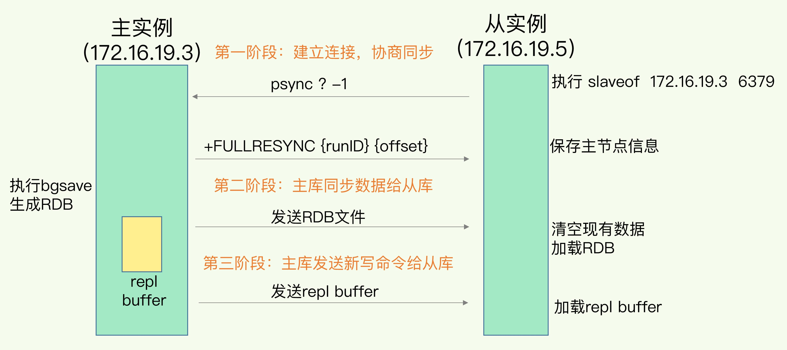
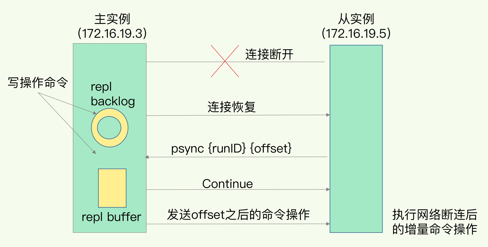

### redis哨兵集群
#### 哨兵(Sentinel)
```Redis哨兵是一组监控Redis服务器状态的进程，它可以监控主节点和从节点是否正常工作。当主节点出现故障或下线时，哨兵会自动将一个从节点升级为新的主节点，以保证系统的高可用性。```

- 哨兵的特点
1. 实现方式：哨兵由一组独立的进程组成，通过主从复制来实现高可用性。
2. 故障检测：哨兵通过心跳机制定期检测Redis节点的状态，当发现节点宕机时，会自动执行故障转移操作。
3. 配置管理：哨兵可以监控多个Redis节点，并且可以自动完成节点切换和配置更新。
4. 动态扩展：哨兵可以动态增加或删除监控的Redis节点，而无需停止整个系统。
5. 适用场景：适用于小规模的Redis部署，能够提供有限的高可用性。

#### 集群(Cluster)
```Redis集群是一种分布式的Redis部署方案，它将数据分散存储在多个节点上，并通过插槽分配将数据均匀地分布在不同的节点上。集群通过节点间的Gossip协议进行通信，实现数据的高可用和负载均衡。```

- 集群的特点
1. 实现方式：集群由多个Redis节点组成，通过Gossip协议进行通信和数据同步。
2. 数据分片：集群将数据分成16384个插槽，然后将插槽分配给不同的节点进行存储。
3. 故障转移：当节点宕机或下线时，集群会自动将它的插槽重新分配给其他节点，以保证系统的高可用性。
4. 水平扩展：集群可以方便地扩展节点数量，以应对不断增长的数据存储需求。
5. 适用场景：适用于大规模的Redis部署，能够提供较高的高可用性和性能。


#### redis命令
- info replication 查看主从复制信息
- info sentinel 查看哨兵集群状态信息

#### 配置文件参数
```
固定哨兵模式对外的 ip
sentinel announce-ip "192.168.0.105"
```
```
# 固定主从模式对外的 ip
replica-announce-ip 192.168.0.105
```

### 主从全量复制关系图



### 主从全量复制流程

1. 第一阶段是主从库间建立连接
- 从库给主库发送 psync 命令，表示要进行数据同步，主库根据这个命令的参数来启动复制。psync 命令包含了主库的 runID 和复制进度 offset 两个参数。runID，是每个 Redis 实例启动时都会自动生成的一个随机 ID，用来唯一标记这个实例。当从库和主库第一次复制时，因为不知道主库的 runID，所以将 runID 设为“？”。offset，此时设为 -1，表示第一次复制。主库收到 psync 命令后，会用 FULLRESYNC 响应命令带上两个参数：主库 runID 和主库目前的复制进度 offset，返回给从库。从库收到响应后，会记录下这两个参数。这里有个地方需要注意，FULLRESYNC 响应表示第一次复制采用的全量复制，也就是说，主库会把当前所有的数据都复制给从库。

2. 第二阶段，主库将所有数据同步给从库。
- 主库执行 bgsave 命令，生成 RDB 文件，接着将文件发给从库。从库接收到 RDB 文件后，会先清空当前数据库，然后加载 RDB 文件。这是因为从库在通过 replicaof 命令开始和主库同步前，可能保存了其他数据。为了避免之前数据的影响，从库需要先把当前数据库清空。在主库将数据同步给从库的过程中，主库不会被阻塞，仍然可以正常接收请求。否则，Redis 的服务就被中断了。但是，这些请求中的写操作并没有记录到刚刚生成的 RDB 文件中。为了保证主从库的数据一致性，主库会在内存中用专门的 replication buffer，记录 RDB 文件生成后收到的所有写操作。

3. 第三个阶段，主库会把第二阶段执行过程中新收到的写命令，再发送给从库。
- 当主库完成 RDB 文件发送后，就会把此时 replication buffer 中的修改操作发给从库，从库再重新执行这些操作。这样一来，主从库就实现同步了。

### 增量复制的流程


先看两个概念：
- replication buffer：Redis和客户端通信也好，和从库通信也好，Redis都需要给分配一个 内存buffer进行数据交互，客户端是一个client，从库也是一个client，我们每个client连上Redis后，Redis都会分配一个client buffer，所有数据交互都是通过这个buffer进行的：Redis先把数据写到这个buffer中，然后再把buffer中的数据发到client socket中再通过网络发送出去，这样就完成了数据交互。所以主从在增量同步时，从库作为一个client，也会分配一个buffer，只不过这个buffer专门用来传播用户的写命令到从库，保证主从数据一致，我们通常把它叫做replication buffer。

- repl_backlog_buffer：它是为了从库断开之后，如何找到主从差异数据而设计的环形缓冲区，从而避免全量复制带来的性能开销。如果从库断开时间太久，repl_backlog_buffer环形缓冲区被主库的写命令覆盖了，那么从库连上主库后只能乖乖地进行一次全量复制，所以repl_backlog_buffer配置尽量大一些，可以降低主从断开后全量复制的概率。而在repl_backlog_buffer中找主从差异的数据后，如何发给从库呢？这就用到了replication buffer。
5. 如果在网络断开期间，repl_backlog_size环形缓冲区写满之后，从库是会丢失掉那部分被覆盖掉的数据，还是直接进行全量复制呢？
- 对于这个问题来说，有两个关键点：一个从库如果和主库断连时间过长，造成它在主库repl_backlog_buffer的slave_repl_offset位置上的数据已经被覆盖掉了，此时从库和主库间将进行全量复制。每个从库会记录自己的slave_repl_offset，每个从库的复制进度也不一定相同。在和主库重连进行恢复时，从库会通过psync命令把自己记录的slave_repl_offset发给主库，主库会根据从库各自的复制进度，来决定这个从库可以进行增量复制，还是全量复制。

6. 当在高可用系统中使用Redis Sentinel，关闭了主服务器的持久化，并且允许自动重启，这种情况是很危险的。比如主服务器可能在很短的时间就完成了重启，以至于Sentinel都无法检测到这次失败